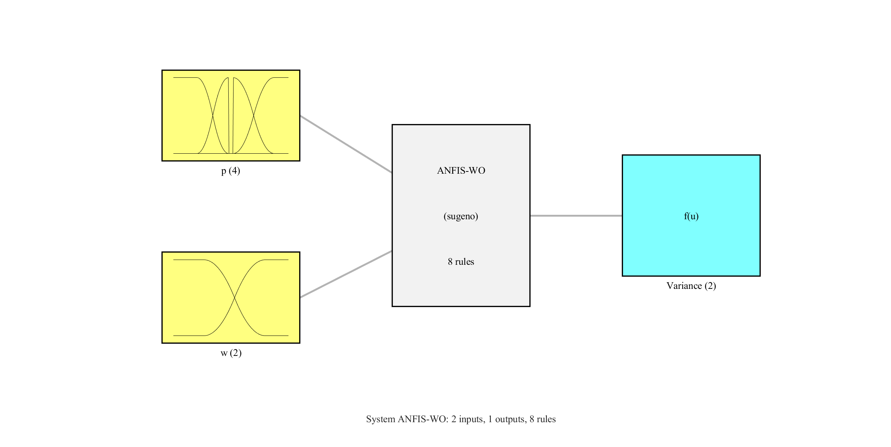

# ANFIS-Matlab-For-VWIO_ESKF
ANFIS-MATLAB For Visual-Wheel-Inertial Odometry ESKF Muti-Sensor Fusion

## Membership Function
### Wheel Velocity Difference p

### Wheel Angular Velocity $\omega$

## Fuzzy Rules Inference

| $\mathrm{\omega}$   | $\mathrm{p}$  | Variance  |
|  :----------------:  | :----------:  | :------:  |
| A6  | A1 | $W_{\text{H}}$ |
| A6  | A2 | $W_{\text{H}}$ |
| A6  | A4 | $W_{\text{H}}$ |
| A5  | A1 | $W_{\text{H}}$ |
| A5  | A4 | $W_{\text{H}}$ |
| A6  | A3 | $W_{\text{L}}$ |
| A5  | A2 | $W_{\text{L}}$ |
| A5  | A3 | $W_{\text{H}}$ |

## FIS Structure
